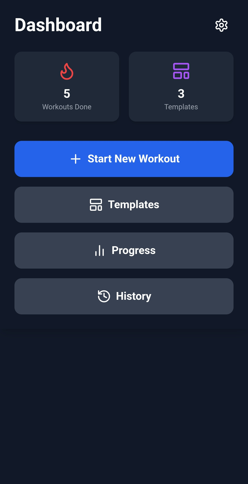
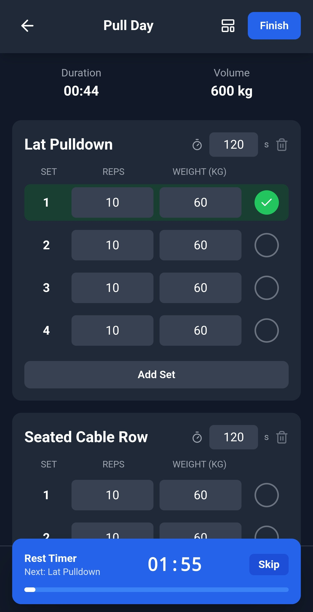
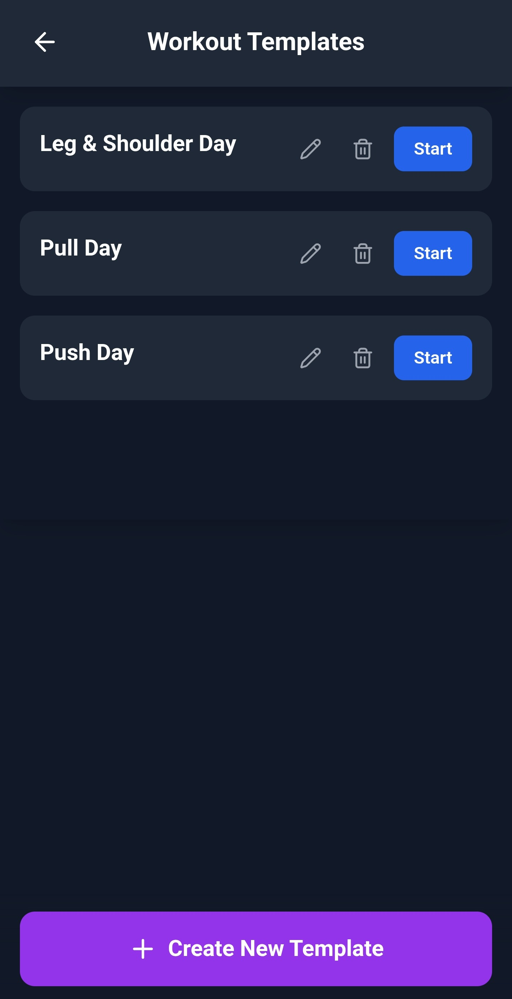
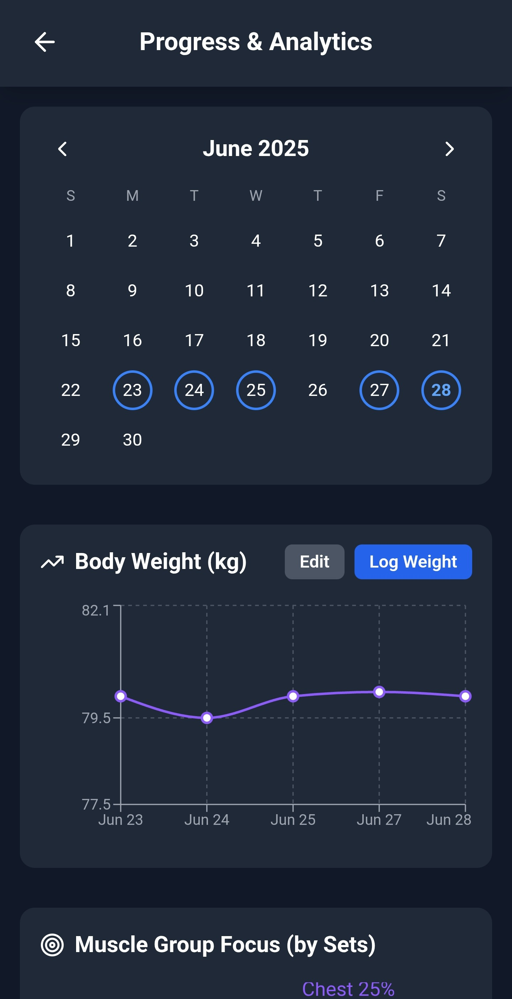
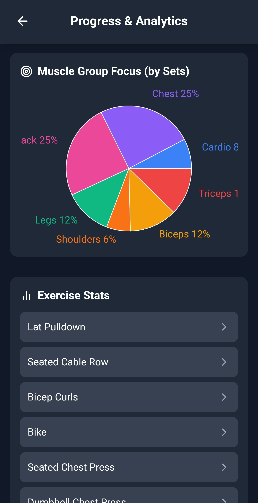
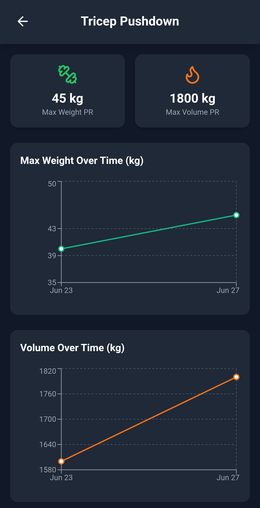
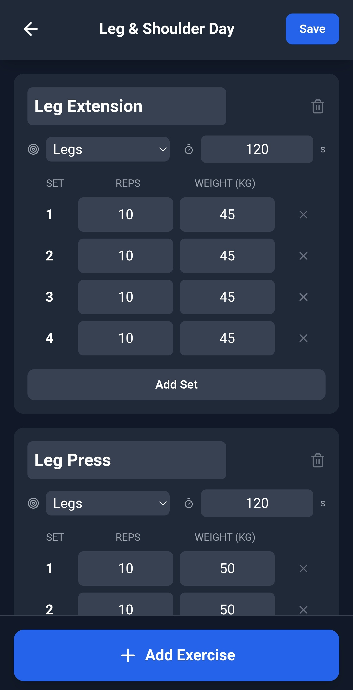
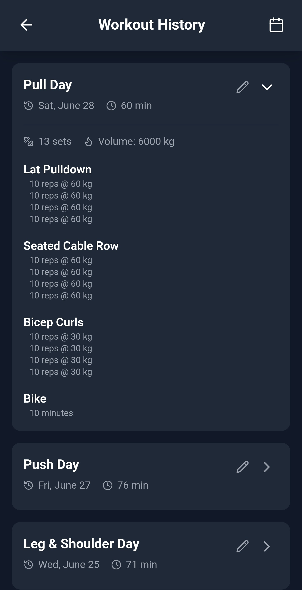
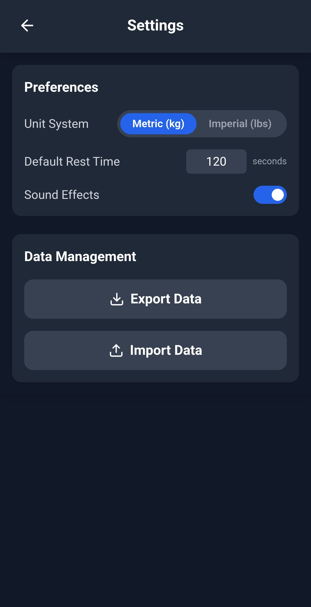

# Gym Tracker 🏋️‍♂️ — Offline‑First Workout Logger

**A sleek, minimal, all-in-one mobile app to track your gym workouts, monitor your progress, and stay motivated. Built with React and designed to run completely offline on your device.**

---

## Features

| Category                     | Highlights                                                                                                                                                                                                  |
| ---------------------------- | ----------------------------------------------------------------------------------------------------------------------------------------------------------------------------------------------------------- |
| **Offline & Data Ownership** | • Works 100 % offline 🔒<br>• No sign‑up or cloud account <br>• One‑tap export & import of your data                                                                                                        |
| **Workout Flow**             | • *Return to Workout* button restores an unfinished session<br>• Auto rest‑timer with sound cues ⏱️<br>• Handles both strength (sets × reps × weight) and cardio (time / distance)                          |
| **Templates**                | • Unlimited preset workouts & exercises 🏗️<br>• Per‑exercise defaults (reps, weight, rest)<br>• Metric ⇄ Imperial switch updates all values instantly                                                      |
| **Progress Analytics**       | • Calendar heat‑map of training days 📆<br>• Body‑weight tracker with line chart<br>• Auto‑detected PRs (max weight & volume) 🏅<br> • Dedicated Cardio PRs (Longest Duration)<br>• Muscle‑group distribution pie chart<br>• Per‑exercise progress graphs |
| **Settings & UX**            | • Custom default rest time<br>• Themed modals replace native alerts<br>• Native Android back‑button support via Capacitor                                                                                   |

---

## 📸 Screenshots

<p align="center">
<table border="0" cellpadding="6" cellspacing="0">
  <tr>
    <td></td>
    <td></td>
    <td></td>
  </tr>
  <tr>
    <td></td>
    <td></td>
    <td></td>
  </tr>
  <tr>
    <td></td>
    <td></td>
    <td></td>
  </tr>
</table>
</p>

---

## Tech Stack

<div align="center">
  
  &nbsp;&nbsp;
  
  &nbsp;&nbsp;
  
  &nbsp;&nbsp;
  
</div>

* **React** — component‑based UI
* **Capacitor** — native shell & device APIs
* **Tailwind CSS** — utility‑first styling
* **Recharts** — responsive charts
* **Lucide React** — iconography

---

## Getting Started

### Prerequisites

* **Node.js** 18 + (includes npm)

```bash
npm install -g npm@latest   # update npm (optional)
npm install capacitor-resources # for icons
```

### Installation & Dev Server

```bash
git clone https://github.com/Git-Aarya/Gym-Tracker.git
cd Gym-Tracker
npm install        # install dependencies
npm install @capacitor/app@^6.0.0 @capacitor/filesystem@^6.0.0
   # Install Capacitor dependencies for native features
npm run start      # launch Vite dev server
```

Visit `http://localhost:5173` in your browser; the page reloads on save.

---

## Building for Mobile

```bash
npm run build   # create production web assets
npx cap sync    # copy assets & sync native deps
npm run resources # create nessecary icons

# then, open in your IDE of choice

npx cap open android   # Android Studio
npx cap open ios       # Xcode (macOS only)
```

### 🛠️ Running on a Mobile Device

#### For Android:

1. Connect your Android device via USB and enable **Developer Mode** and **USB Debugging**.
2. In Android Studio, click **Run** ▶ or select your device from the device list.
3. The app will be installed and launched on your connected device.

#### For iOS:

1. Open the project in Xcode using `npx cap open ios`.
2. Select your iOS device or a simulator.
3. Click **Run** ▶ to build and deploy.
4. Note: You may need a valid Apple Developer account and provisioning profile to install on a physical device. From Android Studio or Xcode, choose an emulator or device and hit **Run**.

---

## Contributing

Pull requests are welcome! Please open an issue first to discuss any major changes.

```bash
# example workflow
fork → feature branch → commit → push → open PR
```

---

## License

This project is licensed under the **MIT License**. See the [`LICENSE`](LICENSE) file for details.


